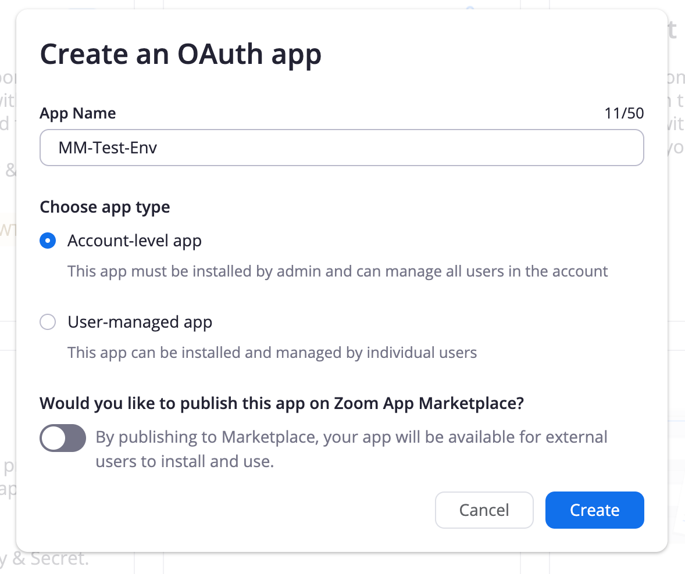

# Zoom Setup \(Account Level App\)

You can set the **OAuth ClientID** and **OAuth Secret**, generated by Zoom, and use it to create meetings and pull user data.

**Account-level Apps** require **an admin to authorize access to all users accounts within the Zoom account**.  Individual users in Mattermost are verified by checking their Mattermost email and requesting their Personal Meeting ID via the Zoom API.  The user's emails in Zoom and Mattermost accounts should match up.   If you prefer for each end user to authorize individually, you should create a Zoom [User-Level App.  ](zoom-setup-user-level-app.md)

## Create an App for Mattermost

* Go to [https://marketplace.zoom.us/](https://marketplace.zoom.us/) and log in as an admin.
* In the top left click on **Develop** and then **Build App**.
* Select **OAuth** in **Choose your app type** section.
* Enter a name for your app.
* Choose **Account-level app** as the app type.
* Choose whether you **Would like to publish this app on Zoom Marketplace**. In most cases you'll want this to be disabled, but the plugin support also apps to be published in the Zoom Marketplace.
* Click **Create**.

## Configure Your New OAuth App to Work with Mattermost

* If you **would like to publish on Zoom Marketplace**, you will find two sets of values: **development** and **production**. Make sure you follow the next steps with the production values.
* Go to the **App Credentials** tab on the left. Here you'll find your **Client ID** and **Client Secret**.
  * These will be needed during [Mattermost Setup]().
* Enter a Valid **Redirect URL for OAuth** \(`https://SITEURL/plugins/zoom/oauth2/complete`\) and add the same URL under **Whitelist URL**.
  * `SITEURL` should be your Mattermost server URL.

## Add User Scopes to the App

* Click on **Scopes**.
* Add the following scopes: **meeting:read**, **user:read**.

## Deauthorization

This plugin allows users to be deauthorized directly from Zoom, in order to comply with Zoom’s commitment to security and the protection of user data. If you **would like to publish on Zoom Marketplace**, you will be able to set up a Deauthorization URL.

* Click on **Information**.
* Near the end of the page, you will find a section called **Deauthorization Notification**.
* Enter a valid **Endpoint URL** \(`https://SITEURL/plugins/zoom/deauthorization?secret=WEBHOOKSECRET`\). 
  * `SITEURL` should be your Mattermost server URL.
  * `WEBHOOKSECRET` is generated during [Mattermost Setup]().

## Finish Setting up Mattermost Server

* Follow the instructions for [Mattermost Setup]()

